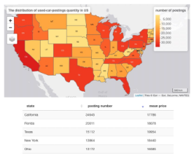
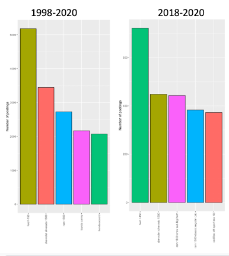
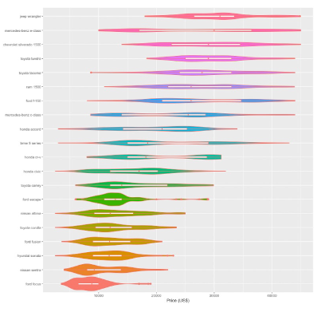

## Introduction

> -   Keretasome is a used car dealership with branches across the entire US that purchases used car from consumer and resells them .Recently they have been concerned with their business performance and would like to know more about the used car market online. Thus, the Slow & Steady have been employed to figure out

## Research Questions

> -   Which US states should Keretasome focus their effort on
> -   Which used cars should Keretasome target?
> -   What can Keretasome reference when pricing used cars?

## Research Objective

> -   To identify the states with the most used-car postings

> -   To identify popular used popular cars available.

> -   To depict median prices of most popular car as reference

------------------------------------------------------------------------

## Which US states should keretasome focus their effort on?

> -   State with most number of posting: California

> -   California exceeds the next highest state by a margin of 14,000 posting.

> -   Next few states \> 10,000 postings & median price between 15,000 - 20,000: Florida, Texas, New York, Ohio

> -   Recommended new outlets for Keretasome be opened in California.
>
>     

------------------------------------------------------------------------

## Which used-car should KeretaSome target?

> -   Overall, the top 3 most available used cars are the Ford F-150, the Chervolet Silverado 1500 and the RAM 1500

> -   These are all pickup truck, the top 2 cars are still the same, with roughly the same ratios

> -   Even when comparing across time

> -   Factors High reliability even in the long-run

> -   Keretasome will have a steady stream of pickup trucks.
>
>     

------------------------------------------------------------------------

## What can Keretasome reference when pricing?

> -   Keretasome needs to ensure their procurement price selling price to ensure profit.

> -   Pricing is difficult

> -   Factors: prices set individually, haggling, various difference in between cars.

> -   Therefore, as a reference for Keretasome, in California, used-cars manufactured in the last decade, and traveled\<150,000 miles are priced as on.
>
>     

------------------------------------------------------------------------

## Data Product: Car-deal-ologist

> -   A dashboard diagnosing used-car data,

> -   Useful for:

> -   Individuals Looking to buy/sell used-cars.

> -   Car enthusiasts that enjoy looking at used-car data.
>
>     
